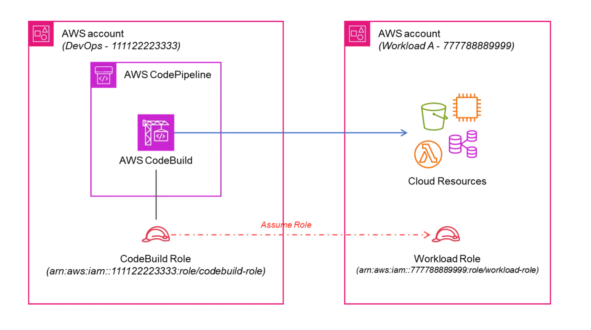

Quản lý multiple envs:
1. sử dụng terraform workspace. khi đó chỉ cần 1 bucket state
2. sử dụng config file cho mỗi môi trường 
# terraform init -reconfigure --backend-config=<path-to-config-file>
# terraform plan/apply -var-file=<path-to-var-file>
3. sử dụng file structure (bị lặp code)

Links:
1. https://dev.to/admantium/terraform-language-compendium-3go8

